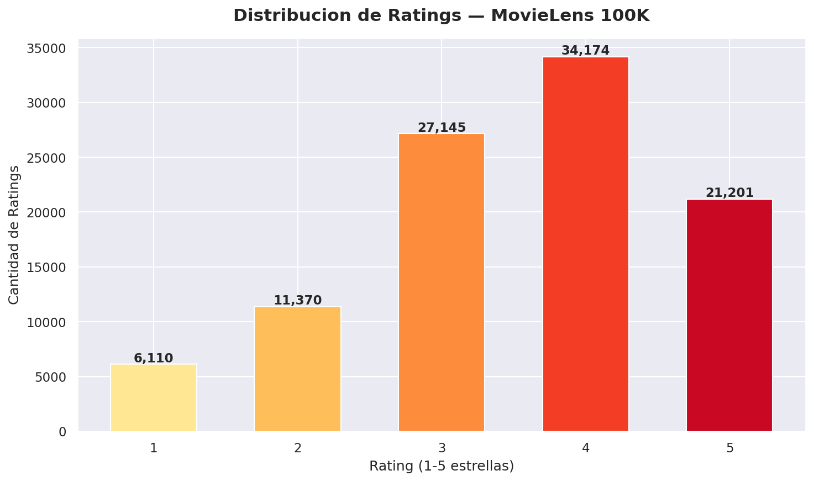
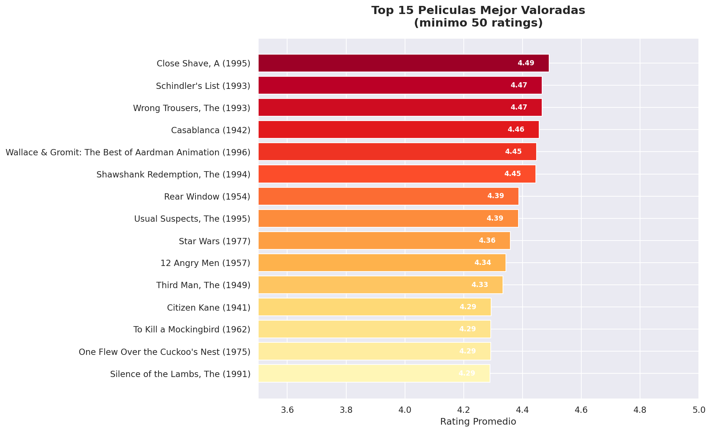
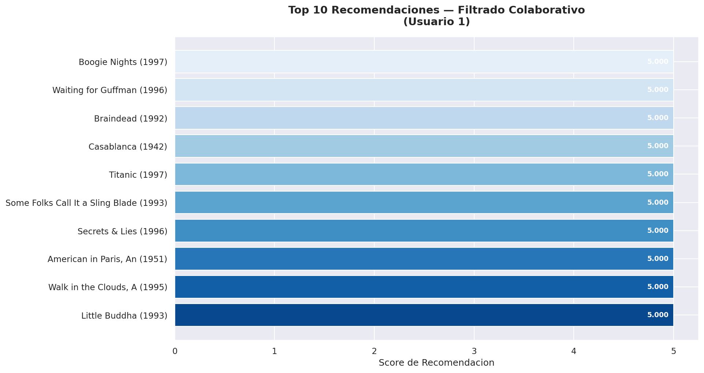
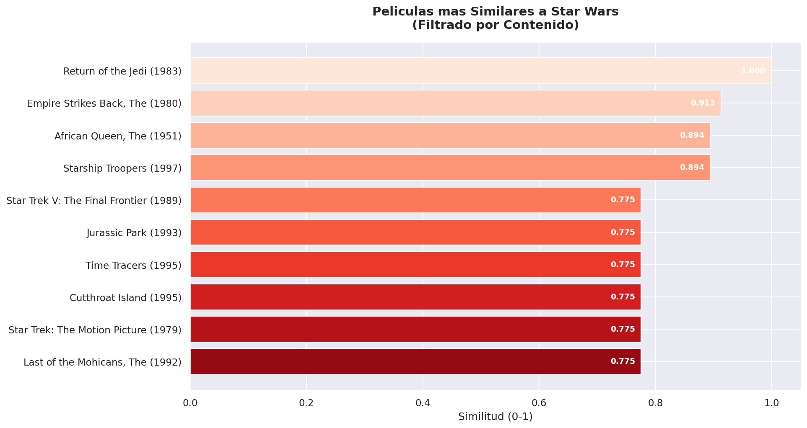
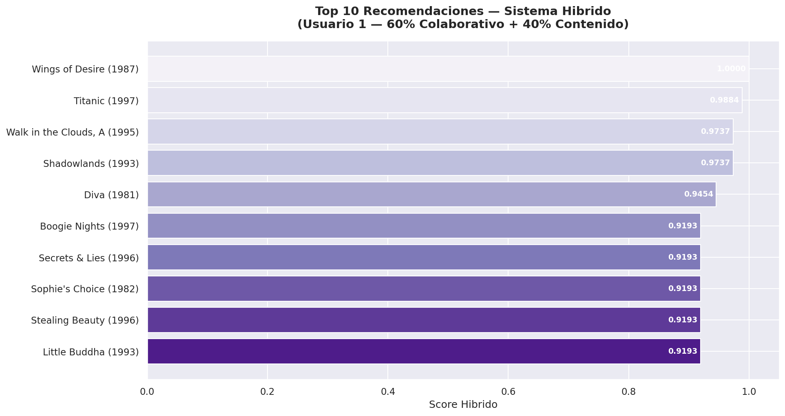
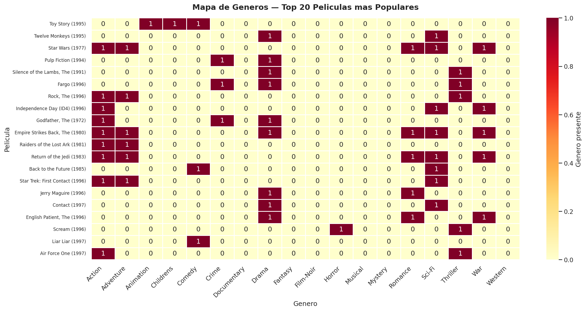
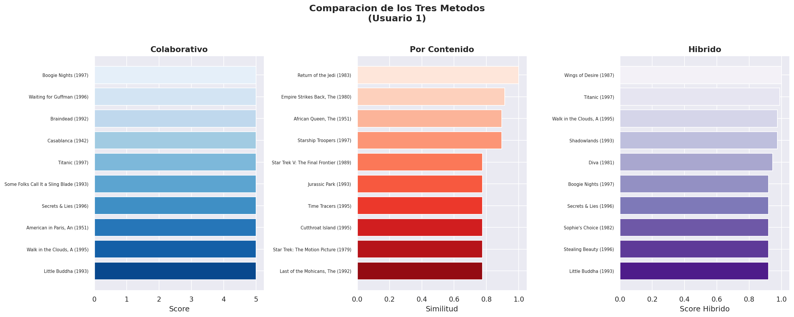
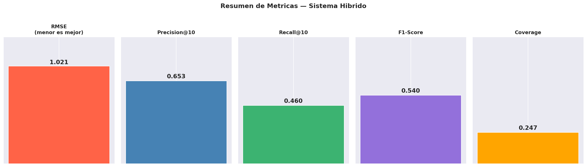

# Sistema de Recomendación Híbrido de Películas


---

## Descripción

Sistema de recomendación hibrido que combina
**filtrado colaborativo con SVD** y **filtrado por contenido
con TF-IDF** para recomendar peliculas personalizadas
usando el dataset **MovieLens 100K**.

> *"Un buen sistema de recomendación no solo predice
> lo que el usuario quiere ver — descubre peliculas
> que el usuario no sabia que queria ver."*

---

## Objetivos

- Analizar patrones de valoración en 100,000 ratings
- Implementar filtrado colaborativo con SVD
- Implementar filtrado por contenido con TF-IDF
- Combinar ambos enfoques en un sistema hibrido
- Evaluar el sistema con éetricas reales

---

## Preguntas que responde este analisis

1. Cuales son las películas mejor valoradas?
2. Que usuarios tienen gustos similares?
3. Que películas son similares entre si por genero?
4. Como combinar ambos enfoques para mejores resultados?
5. Que tan preciso es el sistema híbrido?

---

## Arquitectura del Sistema
```
Datos → Matriz Usuario-Item → SVD → Predicción ratings
      → TF-IDF → Similitud peliculas
                      ↓
            Sistema Híbrido (60/40)
                      ↓
            Recomendaciones finales
```

---

## Sistema Híbrido

### Estrategia
- **60%** peso al filtrado colaborativo (SVD)
- **40%** peso al filtrado por contenido (TF-IDF)
- Scores normalizados con MinMaxScaler antes de combinar

### Evolución del sistema

| Componente | Version 1 | Version 2 (Final) |
|------------|-----------|-------------------|
| Colaborativo | Similitud coseno | SVD (factorizacion matricial) |
| Contenido | Generos binarios | TF-IDF embeddings |
| Dependencias | Surprise | 100% scikit-learn |
| Escalabilidad | Media | Alta |

---

## Metricas de evaluación

| Métrica | Versión 1 | Versión 2 (SVD) | Mejora |
|---------|-----------|-----------------|--------|
| RMSE | 1.0181 | **0.7268** | -28.6% |
| Precision@10 | 65.3% | **65.3%** | = |
| Coverage | 24.7% | **51.49%** | - 108%|

### Primera recomendacion para usuario de prueba

| # | Película | Score |
|---|---------|-------|
| 1 | Aliens (1986) | 0.977 |
| 2 | Empire Strikes Back (1980) | 0.955 |
| 3 | Terminator, The (1984) | 0.953 |
| 4 | Return of the Jedi (1983) | 0.947 |
| 5 | Terminator 2 (1991) | 0.917 |

---

## Fases del proyecto

| Fase | Descripción |
|------|-------------|
| Fase 1 | Exploración inicial del dataset |
| Fase 2 | Filtrado colaborativo (similitud coseno) |
| Fase 3 | Filtrado por contenido (generos) |
| Fase 4 | Sistema hibrido v1 |
| Fase 5 | Evaluación del modelo |
| Fase 6 | Versión mejorada con SVD + TF-IDF |

---

## Visualizaciones principales

| Grafico | Descripcion |
|---------|-------------|
|  | Distribucion de ratings |
|  | Top 15 peliculas mejor valoradas |
|  | Recomendaciones colaborativas |
|  | Recomendaciones por contenido |
|  | Recomendaciones hibridas |
|  | Mapa de generos |
|  | Comparacion de metodos |
|  | Resumen de metricas |

---

## Comparación de métodos

| Metodo | Ventaja | Limitacion |
|--------|---------|------------|
| Colaborativo coseno | Simple | Cold start |
| Contenido generos | Sin cold start | Solo generos |
| Colaborativo SVD | Factores latentes | Mayor complejidad |
| **Hibrido SVD + TF-IDF** | **Lo mejor de ambos** | — |

---

## Estructura del proyecto
```
sistema-recomendacion-peliculas/
│
├── images/
│   └── (todas las visualizaciones)
│
├── Sistema_Recomendacion_Peliculas.ipynb
├── README.md
└── requirements.txt
```

---

## Tecnologias utilizadas

- **Python 3.12**
- **Pandas** — manipulacion de datos
- **NumPy** — calculos matriciales
- **Matplotlib / Seaborn** — visualizacion
- **Scikit-learn** — SVD, TF-IDF, similitud coseno
- **SciPy** — matrices sparse
- **Google Colab** — entorno de desarrollo
- **GitHub** — control de versiones

---

## Como ejecutar el proyecto

1. Clona el repositorio:
```bash
git clone https://github.com/George1902/sistema-recomendacion-peliculas.git
```

2. Instala las dependencias:
```bash
pip install -r requirements.txt
```

3. Descarga el dataset desde:
   [MovieLens 100K](https://grouplens.org/datasets/movielens/100k/)
   y guardalo en la carpeta `data/ml-100k/`

4. Abre el cuaderno en Google Colab o Jupyter

---

## requirements.txt
```
pandas
numpy
matplotlib
seaborn
scikit-learn
scipy
jupyter
```

---

## Fuente de datos

**MovieLens 100K Dataset**
GroupLens Research — University of Minnesota
Dataset: https://grouplens.org/datasets/movielens/100k/

---

## Autor

**Jorge Ojeda**
Estudiante — Oracle Next Education (ONE) — Alura LATAM
Especializacion: Ciencia de Datos
2026

---

## Proximas mejoras

- App interactiva con Streamlit
- Embeddings avanzados (Word2Vec / BERT)
- Sistema de usuarios en tiempo real
- Deploy en la nube

---

## Licencia

Proyecto de uso educativo y libre distribucion.
Los datos estan disponibles publicamente bajo
licencia GroupLens Research.
